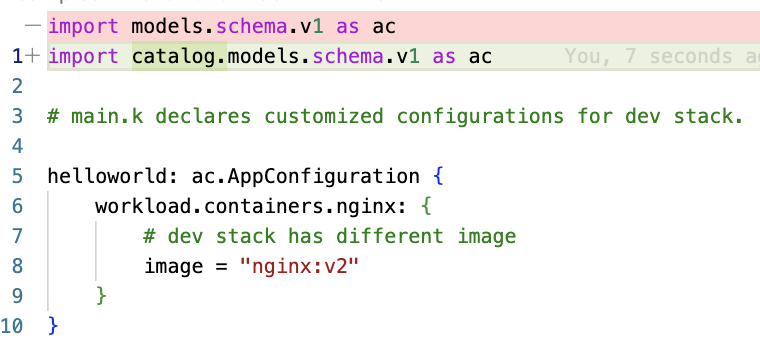

# hellokpm

This is a sample KCL package managed by [kpm](https://github.com/kcl-lang/kpm).

It adds modification on `catalog/modules/samples/helloworld`.

## Supported Version

```
KCL version: v0.5.6
KPM version: v0.3.4
```

## 1. File Structure Changes

### 1.1. For app configuration `hellokpm`

Add `kcl.mod` and `kcl.mod.lock` in the root directory of the 'hellokpm/base' and 'hellokpm/dev'.

```
$ tree hellokpm
hellokpm
    ├── README.md
    ├── base
    │   ├── base.k
    ├── dev
    │   ├── kcl.mod # The dictionary contains 'kcl.mod' can be specified as a kcl package, like 'go.mod'.
    │   ├── kcl.mod.lock # The dictionary contains 'kcl.mod' can be specified as a kcl package, like 'go.mod'.
    │   ├── kcl.yaml
    │   ├── main.k
    │   └── stack.yaml
    └── project.yaml
```

### 1.2. For the `catalog`

The `catalog` must be a kcl package, and it can be imported by the `hellokpm`.

So, the `kcl.mod` and `kcl.mod.lock` are required.

```
$ tree -L 1 catalog
catalog
├── LICENSE
├── README.md
├── kcl.mod # 'kcl.mod' make 'catalog' as a kcl package.
├── kcl.mod.lock # 'kcl.mod.lock' is generated, like 'go.sum', do not modify it manually.
└── models
```

## 2. Code changes

The code changes between `catalog/modules/samples/hellokpm` and `catalog/modules/samples/helloworld`.

### 2.1. For app configuration `hellokpm`

Add the package name in each import statement.

For `hellokpm/dev/main.k`:



## 3. Compile

Under `catalog/models/samples/hellokpm/dev`, run:

```
kpm run
```

Get the result:

```
helloworldcollaset:
  workload:
    containers:
      nginx:
        image: nginx:v1
        command:
        - /bin/sh
        - -c
        - echo hi
        args:
        - /bin/sh
        - -c
        - echo hi
        workingDir: /tmp
    replicas: 2
    type: CollaSet
  opsRule:
    maxUnavailable: 30%
helloworldjob:
  workload:
    containers:
      busybox:
        image: busybox:1.28
        command:
        - /bin/sh
        - -c
        - echo hello
    replicas: 2
    schedule: 0 * * * *
helloworld:
  workload:
    containers:
      nginx:
        image: nginx:v2
        command:
        - /bin/sh
        - -c
        - echo hi
        args:
        - /bin/sh
        - -c
        - echo hi
        env:
          env1: VALUE
          env2: secret://sec-name/key
        workingDir: /tmp
        resources:
          cpu: '2'
          memory: 4Gi
        readinessProbe:
          probeHandler:
            url: http://localhost:80
          initialDelaySeconds: 10
    secrets:
      basic-auth:
        type: basic
        data:
          username: admin
          password: '******'
    replicas: 2
    type: Deployment
```